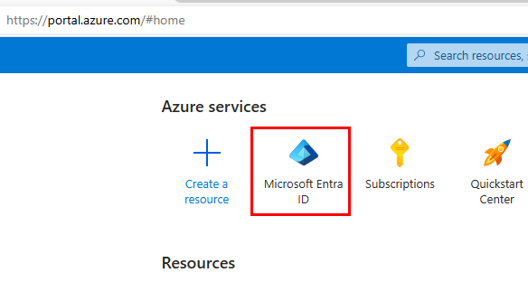
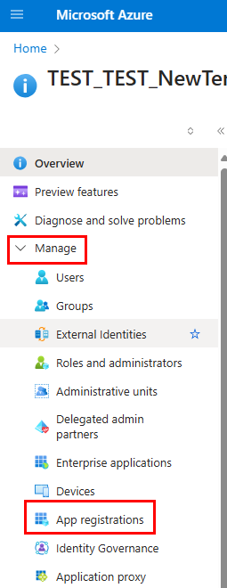
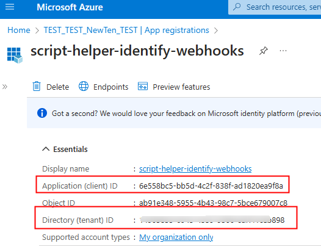
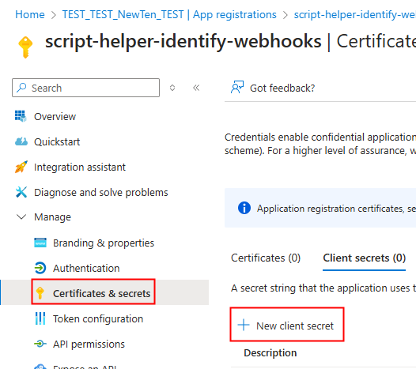
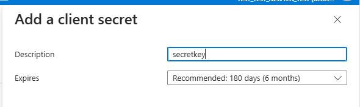
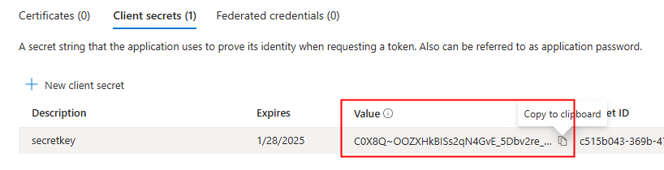
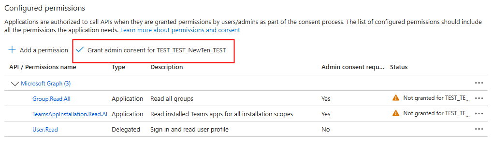

# MS Teams IncomingWebhooks Util

This repo has two script options and a 3rd option using Purview Audit log search.

# Option 1: **List-TeamsWithConenctors.ps1**

This script is comprehensive as it outputs all the connectors (including incoming webhooks, 1st and 3rd party connectors) used in all the Teams in your Tenant. And this script can by run by the global admin and doesnt need any additional setup requirements.

Below GUID can be used to filter the **Add On Guid** column in the csv/spreadsheet to limit the results to Incoming Webhooks
203a1e2c-26cc-47ca-83ae-be98f960b6b2

# Option 2: **List-IncomingWebhooks.ps1**

Enumerates the Teams that are using incoming webhooks. This sample script is using Client ID and Secret and runs in the application context. You must follow below steps as pre-requisites to run the script.

#### Steps 1
1. Navigate to Azure Portal: https://portal.azure.com. Search for "Entra ID" and open it.

    

2. Open **App registrations** under **Manage** in the left nav.

    

3. Click **+ New registration** to register a new Entra App. While registering the app:
    * Provide Name
    * Selet Accounts in this org directory only (Single Tenant)
    * Rediret URI - empty

    

4. Gather the Tenant Id, Client Id

    

5. Create Client Secret by navigating to **Certificates & secrets** under **Manage**

    

    

6. Copy the secret
    
    

7. Navigate to **API permissions** under **Manage**. Click **+ Add a permission**. In the pop-up select **Microsoft Graph**. Then select **Application permissions** block. 

8. Ensure below application permissions are added
    * Group.Read.All
    * TeamsAppInstallation.Read.All

9. Click on **Grant admin consent...** button to grant the selected permissions

    
    
    NOTE: If you do not grant admin consent, the access token fetched will not have the right scopes and the graph query will results in a 403 error.

#### Step 2
1. Update the script with the Tenant Id, Client id, and Client Secret.
2. Run the script

#### Output
You can see the sample output file in this repository. 

# Option 3: Purview

Follow steps listed in List-ConenctorsUsingPurview.md file.